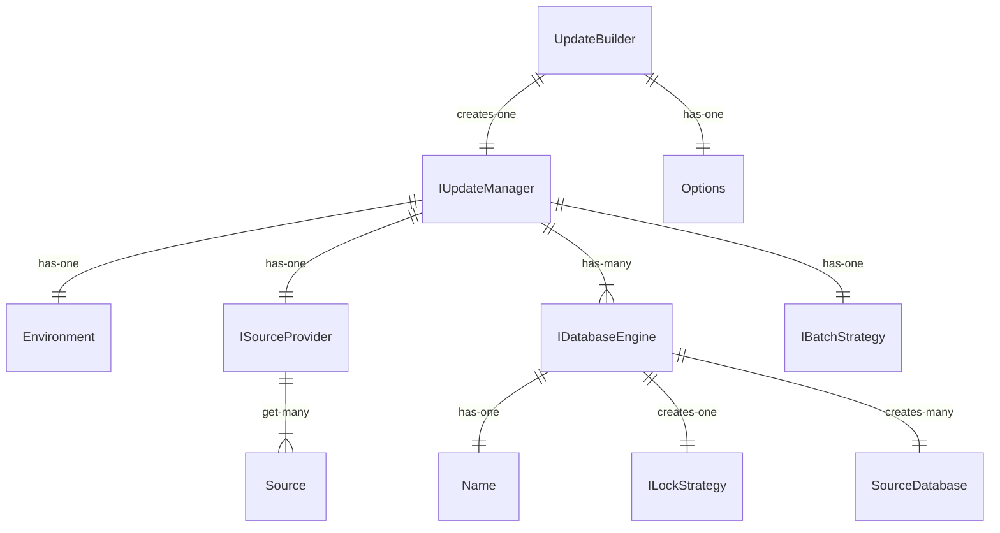

# Upgradier  

A minimalist approach for updating multiple databases concurrently to a version based in conventions.

- [Prerequisites](#prerequisites)
- [Quick start](#quick-start)
- [Usage](#usage)

## Prerequisites
- [.NET SDK 8.0 or later](https://www.microsoft.com/net/download)

## Quick start

- Install [Upgradier.Core](https://www.nuget.org/packages/Upgradier.Core)
- Install the required database engines:
    - [Upgradier.SqlServer](https://www.nuget.org/packages/Upgradier.SqlServer)
- Install aditional batch strategies:
    - [Upgradier.BatchStrategy.Aws](https://www.nuget.org/packages/Upgradier.BatchStrategy.Aws)
    - [Upgradier.BatchStrategy.Azure](https://www.nuget.org/packages/Upgradier.BatchStrategy.Azure)

## Example
Explore a classic use with SqlServer

## Architecture

